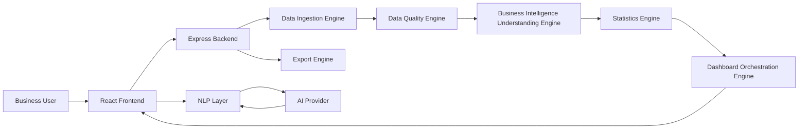
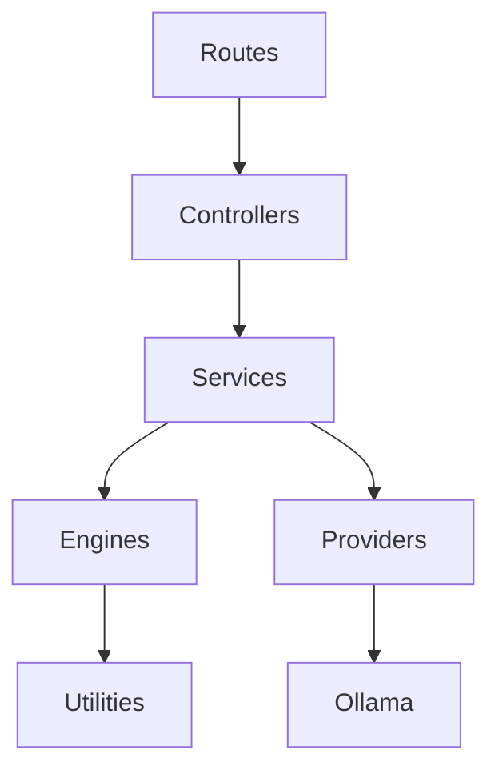
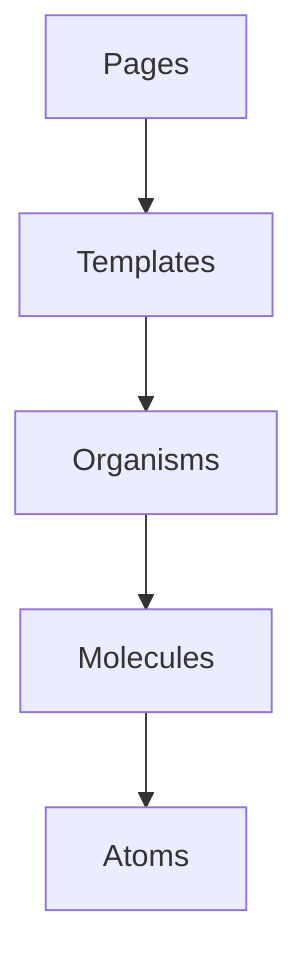

# 22_Architecture_Diagram

Version: 1.0

---

# PulseBI AI - High Level Architecture



---

# Dashboard Generation Flow

```mermaid
flowchart TD

CSV Upload

↓

CSV Validation

↓

Metadata Generation

↓

Metadata Confirmation

↓

Statistics Generation

↓

Dashboard Orchestration

↓

Dashboard JSON

↓

React Dashboard

↓

Business User
```

---

# AI Processing Flow

```mermaid
flowchart TD

User Question

↓

Intent Detection

↓

Context Builder

↓

Prompt Builder

↓

AI Provider

↓

Response Validation

↓

Dashboard Action

↓

Dashboard Update

↓

User Response
```

---

# Data Flow

```mermaid
flowchart LR

CSV

-->

Upload Engine

-->

Metadata Engine

-->

Statistics Engine

-->

Dashboard Engine

-->

React UI

-->

Plotly
```

---

# Backend Architecture



---

# Frontend Architecture



---

# State Management

```mermaid
graph TD

Session Store

-->

Dashboard Store

Session Store

-->

Metadata Store

Session Store

-->

Filter Store

Session Store

-->

Chat Store

Dashboard Store

-->

Components

Metadata Store

-->

Components

Filter Store

-->

Components

Chat Store

-->

Components
```

---

# Dashboard Rendering Flow

```mermaid
flowchart TD

Dashboard JSON

↓

Dashboard Grid

↓

Widget Renderer

↓

Plotly Configuration

↓

Plotly Charts
```

---

# Export Flow

```mermaid
flowchart TD

Dashboard

↓

Export Engine

↓

PDF

PNG

SVG

CSV

Excel
```

---

# Deployment Architecture

```mermaid
graph LR

Browser

-->

React

-->

Express

-->

Ollama

Express

-->

Temporary Session

React

-->

Plotly
```

---

# Design Philosophy

The architecture follows five guiding principles.

Backend computes.

Frontend renders.

AI explains.

Configuration drives rendering.

Business users never configure technical concepts.

---

End of Document